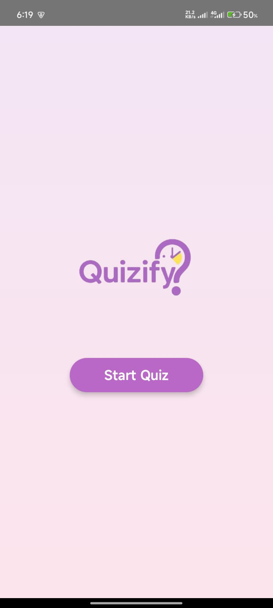

# Quizify — Quiz App with Timer ⏰

## Objective
A simple quiz app built with Jetpack Compose that displays multiple-choice questions one by one with a countdown timer.

## Features
-  5 Multiple Choice Questions
-  10-Second Countdown Timer for Each Question
-  Auto-skip to next question if time runs out
-  Score displayed at the end
-  Clean & Modern UI with Animations
-  Navigation between Home, Quiz, and Result Screens

## How to Run
1. Clone the repository or download ZIP
2. Open in Android Studio (latest version recommended)
3. Sync Gradle and build project
4. Run on Emulator or Physical Android Device

## Screenshots

<h3>🏠 Home Screen</h3>  

<h3>📝 Quiz Screen</h3>  

<h3>🏁 Result Screen</h3>  
